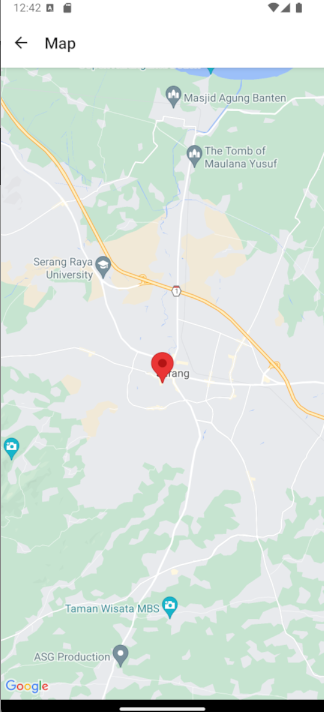

# HospitalApp

HospitalApp is a React Native application that allows users to view a list of COVID-19 hospitals in Indonesia and view their locations on a map. The app fetches hospital data from an API and presents it in a user-friendly interface with hospital names, addresses, and the option to view each hospital's location on a map.

## Features

- Display a list of COVID-19 hospitals with details like name and address.
- Navigate to a map screen to see the location of each hospital.
- Use of `react-navigation` for navigating between screens.
- Integration with `axios` to fetch data from an API.
- Display of hospital-specific images (if available).

## Tech Stack

- **React Native**: JavaScript framework for building native mobile apps.
- **Expo**: Framework for running and building React Native apps.
- **react-navigation**: Library for routing and navigation in a React Native app.
- **axios**: Promise-based HTTP client for the browser and Node.js.
- **react-native-maps**: Map component for displaying map views and markers.

## Installation

1. Clone the repository:

   ```bash
   git clone https://github.com/ajhadi/Binus-Exam-HospitalApp.git
   ```

2. Install dependencies:

   ```bash
   cd HospitalApp
   npm install
   ```

3. Start the app using Expo:

   For Android:
   ```bash
   npm run android
   ```

   For iOS:
   ```bash
   npm run ios
   ```

   For web:
   ```bash
   npm run web
   ```

## API

The app fetches the list of hospitals from the following API:

```
https://dekontaminasi.com/api/id/covid19/hospitals
```

### Example Response:
```json
[
  {
    "name": "RS UMUM DAERAH  DR. ZAINOEL ABIDIN",
    "address": "JL. TGK DAUD BEUREUEH, NO. 108 B. ACEH",
    "region": "KOTA BANDA ACEH, ACEH",
    "phone": "(0651) 34565",
    "province": "Aceh"
  },
  {
    "name": "RS UMUM DAERAH CUT MEUTIA KAB. ACEH UTARA",
    "address": "JL. BANDA ACEH-MEDAN KM.6 BUKET RATA LHOKSEUMAWE",
    "region": "KOTA LHOKSEUMAWE, ACEH",
    "phone": "(0645) 46334",
    "province": "Aceh"
  }
]
```

## App Screens

### Hospital List Screen
The main screen that lists the hospitals. Each hospital is shown with its name, address, and a link to view its location on a map.

### Map Screen
Displays a map with a marker for the selected hospital. The map is centered based on the hospital's province coordinates.

## Dependencies

```json
"dependencies": {
  "@react-navigation/native": "^7.0.0",
  "@react-navigation/stack": "^7.0.0",
  "axios": "^1.7.7",
  "expo": "~51.0.28",
  "expo-status-bar": "~1.12.1",
  "react": "18.2.0",
  "react-native": "0.74.5",
  "react-native-gesture-handler": "^2.20.2",
  "react-native-maps": "1.14.0",
  "react-native-reanimated": "^3.16.1",
  "react-native-safe-area-context": "^4.14.0",
  "react-native-screens": "^4.0.0",
  "react-navigation": "^5.0.0"
}
```

## Screenshots

### Hospital List Screen


### Map Screen


## Contributing

1. Fork the repository.
2. Create a new branch (`git checkout -b feature-name`).
3. Commit your changes (`git commit -am 'Add new feature'`).
4. Push to the branch (`git push origin feature-name`).
5. Create a new Pull Request.